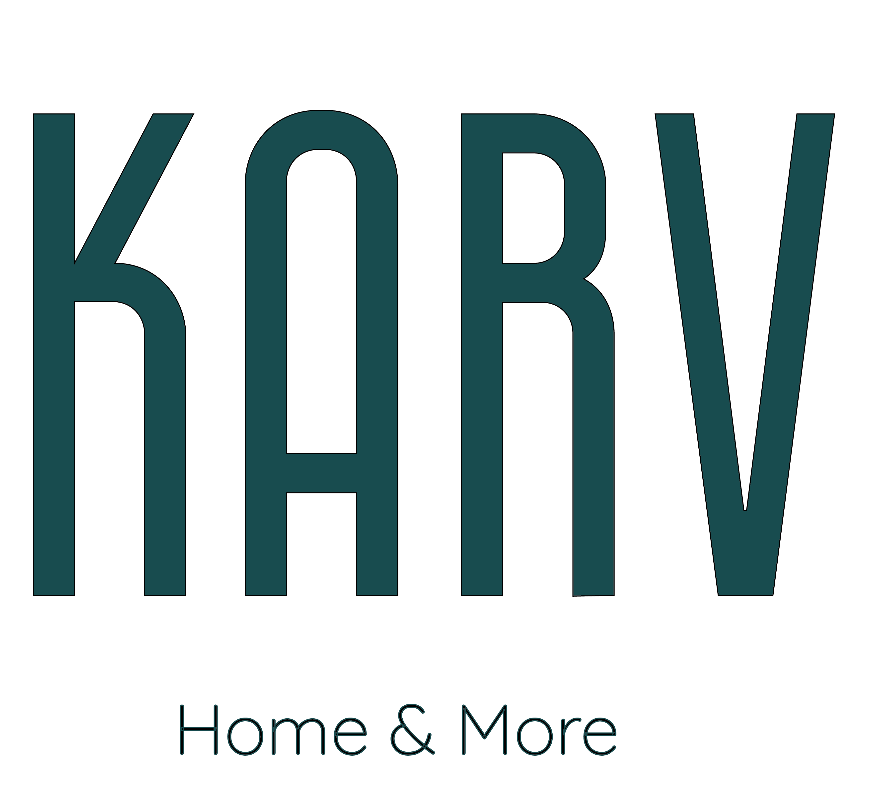

# KARV Homes

## About KARV Homes

KARV Homes is a modern property management application designed to streamline tenant experiences in residential and commercial properties. The app provides tenants with easy access to their bills, payment history, profile management, and seamless payment processing through integrated gateways.

### Key Features

- **Tenant Dashboard**: Personalized home page with welcome messages and quick access to recent bills
- **Bill Management**: View, track, and pay monthly rent and overdue charges
- **Payment Integration**: Secure payments via Razorpay with instant receipt generation
- **Profile Management**: Comprehensive tenant profiles with unit details, lease information, and personal data
- **Receipt Generation**: PDF-friendly receipts with detailed breakdowns and payment confirmations
- **Responsive Design**: Optimized for desktop and mobile devices

## Technology Stack

This application is built using modern web technologies:

- **Frontend**: React 19 with TypeScript for type-safe development
- **Styling**: Tailwind CSS for utility-first responsive design
- **Animations**: Framer Motion for smooth user interactions
- **Backend**: Firebase (Firestore for data, Authentication for users, Storage for files)
- **Payments**: Razorpay integration for secure payment processing
- **Receipt Generation**: html2canvas and jsPDF for PDF receipts
- **Build Tool**: Vite for fast development and optimized production builds

## Architecture

The app follows a component-based architecture with:
- Custom UI components (Card, StatCard, InfoRow)
- Context-based state management for authentication
- Firebase Admin SDK for data seeding and management
- Modular routing with React Router
- TypeScript interfaces for type safety across the application

## Getting Started

To experience KARV Homes, tenants can log in with their credentials to access their personalized dashboard, view bills, make payments, and manage their profiles.